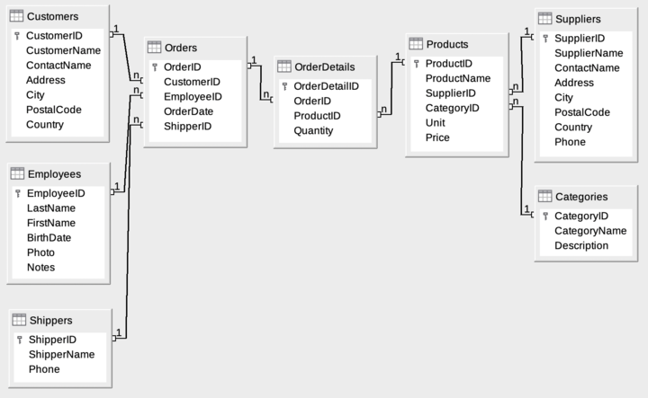

### 1.- Identificadores (ID)
    Campo para identificar un registro entero
Cual es el problema que vienen a solucionar, veamoslo

si agregamos nuevamente

**INSERT INTO users (name,lastname,age)
VALUES("Moises","Mendoza",25)**

Veremos la tabla

|name|age|lastname|
|---|---|---|
|Moises|Mendoza|25|
|Aaron| Mendoza|22|
|Alejandra|none|17|
|Moises|Mendoza|25|

¿Como podemos identificar que el valor de la fila 1 y la 4 son diferentes? No podemos.

Por ello existen los identificadores

Creamos el identificador **id_user**.

Sin embargo no lo podemos crear ahora por lo que tendremos que eliminar los registros para que no haya iguales

**DELETE FROM users**

|name|age|lastname|
|---|---|---|
    AI: auto incremento
    PK: Primary Key

**INSERT into users (name,age,lastname)
VALUES ("Moises",25,"Mendoza");
SELECT * FROM users**

|id_user|name|age|lastname|
|---|---|---|---|
|1|Moises|Mendoza|25|

Si corremos el código nuevamente nos encontraremos con el siguiente resultado

|id_user|name|age|lastname|
|---|---|---|---|
|1|Moises|Mendoza|25|
|2|Moises|Mendoza|25|

El siguiente dato ya lo podemos diferenciar gracias al identificador **id_user**

#### 2.- Tenemos dos tipos de identificadores las claves primarias y las claves foraneas

**PK Las Claves Primarias nos permiten identificar un registro como único**

**FK Las Claves Foraneas nos permiten hacer referencia a una clave primario de otra tabla**

Vamos a crear una nueva tabla

**CREATE TABLE "Turnos_medicos" (
	"id_turno"	INTEGER,
	"profesional"	TEXT,
	"id_user"	INTEGER,
	"motivo"	TEXT,
	"horario"	TEXT,
	PRIMARY KEY("id_turno" AUTOINCREMENT)
);**

Agregado valores

**INSERT into Turnos_medicos (profesional,id_user,motivo, horario)
VALUES ("Dr. Galleta",3,"Dolor de panza", "12:30");
SELECT * FROM  Turnos_medicos**

|id_turno|profesional|id_usuario|motivo|horario|
|---|---|---|---|---|
|1|Dr. Galleta|6|Dolor de panza|12:30|

Agregamos otro valor

**INSERT into Turnos_medicos (profesional,id_usuario,motivo, horario)
VALUES ("Dr. Galleta",3,"Dolor de cabeza", "11:30");**

----------
### 3 y 4.- DIAGRAMA ER DE NORTHWIND, Base de Datos Northwind

[Base de datos de Northwind](https://en.wikiversity.org/wiki/Database_Examples/Northwind/SQLite)

### 5- AS y ORDER BY

**SELECT * FROM Employees**

|EmployeeID|LastName|FirstName|BirthDay|Photo|Notes|
|---|---|---|---|---|---|
|1|Davolio|Nancy|25180|EmpID1.pic|Education includes a BA ...|
|2|Fuller|Andrew|19043|EmpID2.pic|Andrew received his BTS commercial and a Ph.D...|
|3|Leverling|Janet|23253|EmpID3.pic|Janet has a BS degree in chemistry...|
|4|Peacock|Margaret|21447|EmpID4.pic|Margaret ...|

Si deseamos cambiar el nombre de las campos sin cambiarlo directamente en la Base de Datos podemos a usar AS
    
    La magia del **SELECT** es que nos devuelve nuevas tablas.

**SELECT LastName FROM Employees**

|LastName|
|---|
|Davolio|
|Fuller|
|Leverling|
|Peacock|

    Solo se modifica la visualización, no la base de datos

**SELECT LastName AS Apellido FROM Employees**

|Apellido|
|---|
|Davolio|
|Fuller|
|Leverling|
|Peacock|

Se usa para agregarle un nombre mas descriptivo a la tabla. Si hay un campo con nombre Raro que eso no deveria suceder.

**SELECT price,price*2 AS Precio_Doble FROM Products**

|Price|Price_doble|
|---|---|
|9|18|
|2|4|

Con **ORDER BY** Nos permite ordenar los valores de manera ascendente

**SELECT * FROM Products 
ORDER by Price**

|ProductID|ProductName|SupplierID|CategoryID|Unite|Price|
|---|---|---|---|---|---|
|33|Geitost|15|4|500 g|2.5|
|24|Guaraná Fantástica|10|1|12 - 355 ml cans|4.5|

Ordenar de manera ascendente

    SELECT * FROM Products 
    ORDER by Price ASC

Ordenar de manera descendente

    SELECT * FROM Products 
    ORDER by Price DESC

Ordena siguiendo el orden gerarquico

    Null
    Numeros
    Caracteres especiales
    Letras

NULLS FIRST o NULLS LAST nos permite cambiar el orden especifico de algún valor

    SELECT * FROM Products 
    ORDER by ProductName DESC NULLS FIRST

La función RANDOM() nos arroja valores de forma aleatoria.

    SELECT * FROM Products 
    ORDER by random() NULLS FIRST

Ordenar por mas Valores

    SELECT * FROM Products 
    ORDER by ProductName, ProductID ASC

Filtrar por valores duplicados, permitiendonos mantenes valores sin duplicar

    SELECT DISTINCT ProductName FROM Products 

Podemos mezclar funciones como filtra los que no se repiten y además los ordena

    SELECT DISTINCT ProductName FROM Products 
    ORDER BY ProductName ASC

### 6- CLAUSULA WHERE
Dentro de una tabla puedo Filtrar datos con la clausala Where. Por ejemplo

    SELECT * FROM Products 
    where ProductID = 25

|ProductID|ProductName|supplierID|CategoryID|Unit|Price|
|---|---|---|---|---|---|
|25	|NuNuCa Nuß-Nougat-Creme|	11|	3	|20 - 450 g glasses	|14|

Me a aarojado el producto con el ProductID igual a 25

Podemos filtrar por rango
Me dara la lista de todos lo que tengan precio menor o igual a 32

    SELECT * FROM Products 
    where Price <=32

Incluso si deseamos eliminar un registro podemos usar esta clausula.

    DELETE FROM turnos_medicos
    WHERE it_turno = 3

Podemos actualizar los datos tambien

    UPDATE turnos_medicos SET horario = "10:30"
    where id_turno = 2;

Condicionales AND OR
**AND Y OR**
    SELECT * FROM Customers
    where CustomerID >= 50 AND CustomerID <55

Podemos de igual manera combinar condicionales y con lo parentesis darles prioridad

    SELECT * FROM Products
    where (price < 20 or CategoryID = 6) AND    SupplierID = 7

La clausula NOT nos ayuda a negar
**NOT**

    SELECT * FROM Customers
    where not Country = "USA"

Igual podemos combinar

    SELECT * FROM Customers
     where not Country = "USA" AND NOT Country = "France"

Combinamos las clausulas AND y NOT ademas de un limite que solo nos arroje 5 resultados
**LIMIT**

    SELECT * FROM Customers
    where CustomerID >=50
    and not Country = "Germany"
    and not Country = "Canada"
    LIMIT 5

Ahora si queremos siempre valores diferentes
**ORDER BY RANDOM()**

    SELECT * FROM Products
    where not CategoryID = 6
    and not SupplierID = 1
    and Price <= 30
    order by random()
    LIMIT 5

## DISTINTO vs NOT

    SELECT * FROM Customers where not Country = "USA"

Not es un operador lógico

    SELECT * FROM Customers where Country != "USA"

Mientras distinto de es un operador de comparación

Es decir si queremos saber cual valor de Country es distinto a "USA" podemos comparar cada valor con !=, este operador de comparación revisa que cada valor al compararse sea diferente y al ser Verdad lo guarda.

Mientras que los operadores lógicos AND, OR comparan solo valores TRUE y FALSE directamente para guargar valores.

### OPERADOR BETWEEN

    SELECT * FROM Products WHERE Price BETWEEN 20 AND 40

Me devuelve valores entre 20 y 40

    SELECT * FROM Employees WHERE BirthDate BETWEEN "1960-0-1" AND "1970-0-1"

También lo podemos utilizar para fechas entre rangos como por ejemplo las fechas de nacimientos.

Cual es la diferencia de usar el operador AND? ninguna es el mismo proceso interno, solo disminuye la cantidad de código permitiendo que sea más legible.

### OPERADOR LIKE

Busqueda por patron de letras.

Es más simple y limitado, es parecido a =

    SELECT * FROM Employees WHERE LastName like "%r"

Un comodin que tenemos es % porcentaje, nos permite buscar valores que contengar al final un R "%R".
Si queremos que empieze con R nos queda "R%"
o siquiero que contenga cualquier cosa al principio o al final usamos "%R%".

    SELECT * FROM Employees WHERE LastName like "_u____"

Tambien tenemos el comodin estandar _ que nos permite buscar la palabra que contenga una letra al principio, una U después y al final cuatro letras más.

SELECT * FROM Employees WHERE LastName like "_u__%"

Tambien tenemos el comodin estandar _ que nos permite buscar la palabra que contenga una letra al principio, una U después y al final % cualquier cosa con el patron de texto.

### IS NULL O IS NOT NULL

    SELECT * FROM Products WHERE ProductName IS NULL

me regresa los valores que contengas null en productName

    SELECT * FROM Products WHERE ProductName IS NOT NULL

Me regresa los valores que no tengan null en ProductName

### Instrocción a las subconsultas
### OPERADOR IN

    SELECT * FROM Products WHERE SupplierID IN (3,4,5,6)

IN nos permite simplificar una consulta contatenada de or para hacer una consulta sencilla por medio de una tupla

La podemos utilizar en SELECT, UPDATE Y DELETE

    SELECT * FROM Employes WHERE LastName NOT IN ("Fuller","King")

Aqui obtenemos todos los valores que no correspondan a la tupla, gracias al NOT IN

